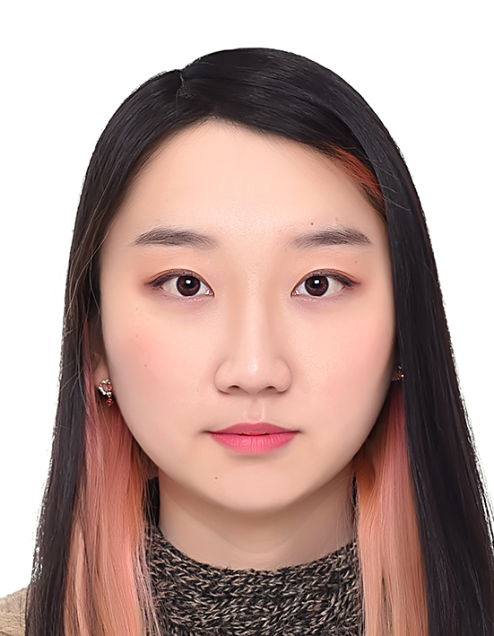
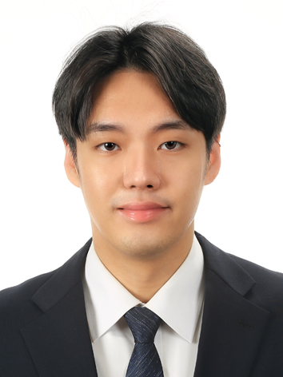
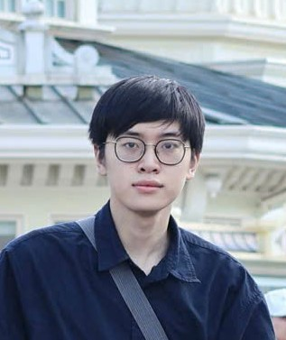
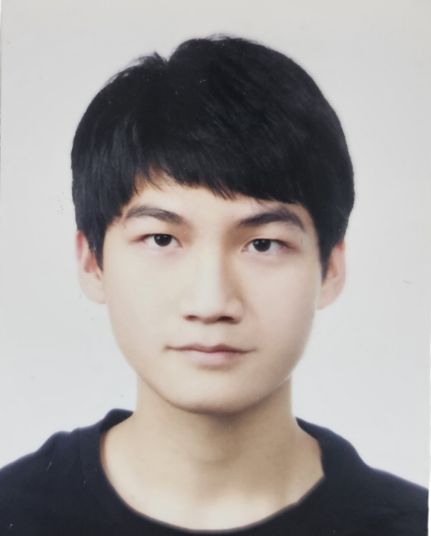
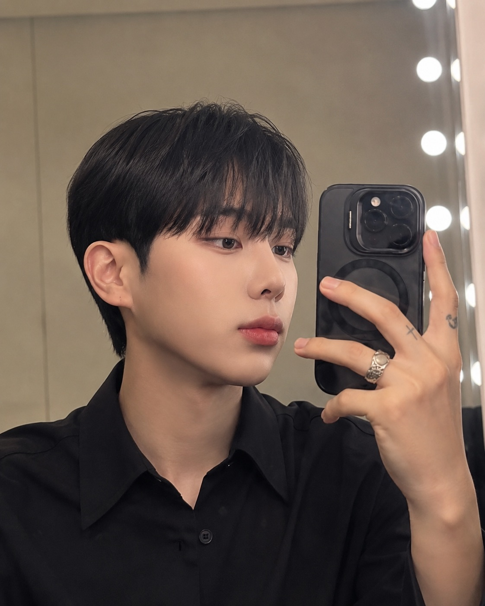
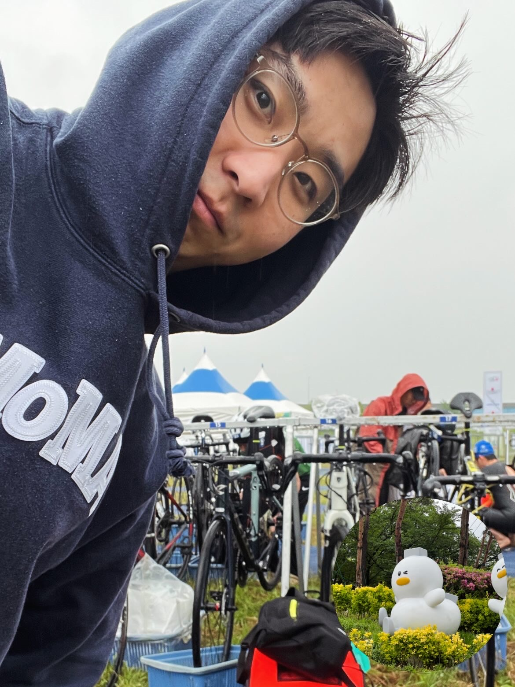

# GVR Lab @ Sejong University

> 🚧 This page is under construction. Content may change without notice. 🚧

## About GVR Lab

The Graphics & Virtual Reality (GVR) Lab at Sejong University researches the core 
technologies behind realistic XR experiences and spatial computing — from AI-driven 
content generation to real-time immersive rendering.

**Research Areas**
- AI-driven XR content synthesis
- Multimodal human-computer interaction
- Spatial sensing and 3D reconstruction
- Real-time immersive rendering

**Center Affiliation**
- The lab hosts the ITRC Ultra-Realistic XR Research Center, coordinating research 
collaborations across academia and industry.

**Collaborations**
- Our work has been carried out in collaboration with research groups at ETH Zurich, 
Disney Research, and medical institutions including Samsung Medical Center and Seoul 
National University Hospital, spanning areas such as medical simulation and digital 
entertainment.

## Members

  
  

    <strong>Kim Ye-eun</strong> 
    Ph.D. Student 
    Research interests: Extended Reality (XR), Human-Computer Interaction, Digital Contents and Interactive Art 
    kyy1462@sejong.ac.kr · <a href="https://www.dbpia.co.kr/author/authorDetail?ancId=585097343">DBpia</a>
  

  
  

    <strong>Safari Bazargani Jalal</strong> 
    Ph.D. Student 
    Research interests: Extended Reality (XR), Human-Computer Interaction, Scene Graph Generation, Scene Synthesis 
    j.safari@sejong.ac.kr · <a href="https://jaysafari.github.io/">Homepage</a>
  

  

    
  

  

    <strong>Rahimi Fatema</strong> 
    Ph.D. Student 
    Research interests: Extended Reality (XR), Human-Computer Interaction, Education 
    fatemehr937@gmail.com · <a href="https://www.linkedin.com/in/fatema-rahimi-87bb36155">LinkedIn</a>
  

  
  

    <strong>Jeon Jong-min</strong> 
    Ph.D. Student 
    Research interests: MR/VR Interaction, 3D Reconstruction, Vision-Language Models for Virtual Agents 
    jjm6564@sju.ac.kr · <a href="https://jjm6564.github.io/">Homepage</a>
  

  
  

    <strong>Kim Phil-joong</strong> 
    Ph.D. Combined Program 
    Research interests: Extended Reality, Mixed Reality, HCI, On-device AI Integration for Immersive Environments 
    fjfo1010@naver.com
  

  
  

    <strong>Do Thanh Trung</strong> 
    Ph.D. Combined Program 
    Research interests: Extended Reality, BCI, Virtual Agent 
    dothanhtrung0210@sju.ac.kr
  

  
  

    <strong>Lee Sung-yo</strong> 
    Master's Student 
    Research interests: Extended Reality, IoT 
    sungyo0421@naver.com
  

  
  

    <strong>Seo Jeong-hoon</strong> 
    Master's Combined Program 
    Research interests: Extended Reality (XR), Human-AI Interaction, Multimodal Interaction, 3D Vision, Spatial Computing 
    tr774@naver.com · Instagram: <a href="https://instagram.com/_laurent.h_">@_laurent.h_</a>
  

  
  

    <strong>Kang Yun-seong</strong> 
    Master's Student 
    Research interests: 3D Gaussian Splatting, NVS, SfM Pipelines, Spatial Computing 
    ys.blef.k@sju.ac.kr · <a href="https://www.youtube.com/@BK_Work">YouTube</a>
  

    
*Last updated: September 2026*
