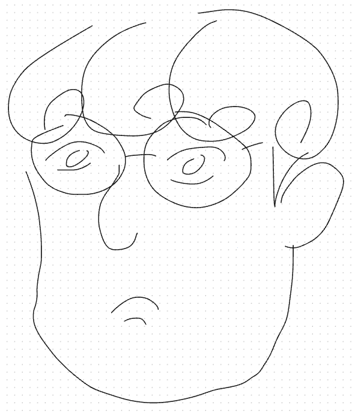

# GVR Lab @ Sejong University

> 🚧 This page is under construction. Content may change without notice. 🚧

## About GVR Lab

The Graphics & Virtual Reality (GVR) Lab at Sejong University researches the core 
technologies behind realistic XR experiences and spatial computing — from AI-driven 
content generation to real-time immersive rendering.

**Research Areas**
- AI-driven XR content synthesis
- Multimodal human-computer interaction
- Spatial sensing and 3D reconstruction
- Real-time immersive rendering

**Center Affiliation**
The lab hosts the ITRC Ultra-Realistic XR Research Center, coordinating research 
collaborations across academia and industry.

**Collaborations**
Our work has been carried out in collaboration with research groups at ETH Zurich, 
Disney Research, and medical institutions including Samsung Medical Center and Seoul 
National University Hospital, spanning areas such as medical simulation and digital 
entertainment.

## Members

  
  

    <strong>Prof. Hong Gil-dong</strong> 
    Principal Investigator 
    Research interests: Computer Graphics, Spatial Computing
  

  
  

    <strong>Kim Min-jun</strong> 
    PhD Candidate 
    Research interests: 3D Gaussian Splatting, SfM Pipelines
  

  
  

    <strong>Lee Ji-woo</strong> 
    Master's Student 
    Research interests: Spatiotemporal 3D Mapping, XR Interfaces
  

*Last updated: September 2026*
